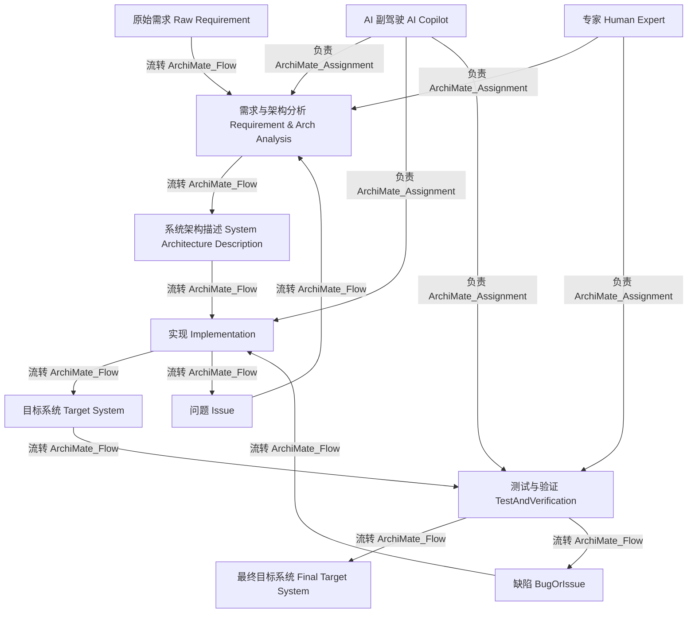
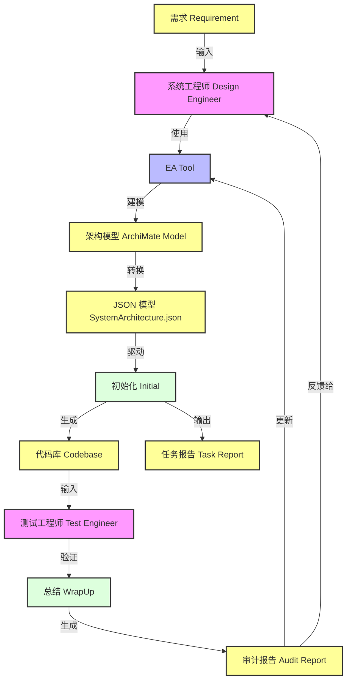

# AI For Project Building - model-driven-system-architecture (AI 驱动的项目构建系统架构)

本项目定义了一套基于 **AI Copilot** 辅助的、模型驱动（Model-Driven）的系统架构设计与落地流程。通过结合 ArchiMate 标准建模语言与 AI 智能体，实现从**原始需求**到**最终交付系统**的全链路闭环。

> 当前工程约定：EA 导出采用 **bootstrap + 本地共享脚本** 模式，参数配置统一通过项目根目录 `.aicodingconfig` 管理。

## 📖 核心理念

本架构的核心在于将传统的软件工程（需求分析、架构设计、实现、测试）通过结构化的**知识图谱（Knowledge Graph）**进行串联，确保每一步产出都可追溯、可验证，并由 AI 深度参与各个环节。

### 🔥 关键特性
*   **全链路模型驱动**：不只是写代码，而是构建包含业务（Business）、应用（Application）、技术（Technology）的全层级架构模型。
*   **AI Copilot 深度集成**：AI 不仅是编码助手，更是架构师的副驾驶（Co-pilot），参与需求分析、架构差距分析（Gap Analysis）和策略制定。
*   **闭环验证体系**：从“原始需求”到“最终目标系统”，中间经过严格的“测试与验证”流程，确保交付质量。

---

## 🏗️ 系统架构全景

本系统架构由以下几个核心领域构成（基于 ArchiMate 建模）：

### 1. 业务战略与目标 (Strategy & Business)
这是系统的顶层设计，定义了“我们为什么要做”以及“如何创造价值”。
*   **Outcome (成果)**: 预期的商业或业务结果。
*   **CourseOfAction (行动方针)**: 实现目标所需的具体策略路径，驱动系统需求的产生。
*   **StrategyBehavior (战略行为)**: 抽象了 **Value Stream (价值流)** 和 **Capability (能力)**，是系统核心竞争力的体现。
*   **Resource (资源)**: 支持战略行为的必要资产。

### 2. 核心架构体系 (Core Architecture)
这是连接业务目标与技术实现的桥梁。
*   **System Architecture Description (系统架构描述)**: 核心文档对象，它聚合了所有层级的架构设计，包括：
    *   **Business Target Architecture**
    *   **Application Target Architecture**
    *   **Technology Target Architecture**
    *   **Target Core Architecture**
*   **Core Architecture Gap (架构差距)**: 明确“当前状态”与“目标状态”之间的差异，由系统需求来填补。

### 3. 表征与实现流程 (Process & Implementation)
这是从设计到落地的执行层。
*   **Workflow (工作流)**:
    1.  **Requirement Analysis And System Architecture Analysis**: 处理 **Raw Requirement (原始需求)**，转化为结构化的 **System Requirement (系统需求)**。
    2.  **Implementation**: 依据系统需求构建 **Target System (目标系统)**。
    3.  **TestAndVerification**: 验证目标系统，发现 **BugOrIssue (缺陷或问题)**，最终产出 **Final Target System (最终目标系统)**。
*   **Feedback Loop (反馈闭环)**:
    *   **Issue**: 实现过程中发现的问题会反馈回需求分析阶段，触发新一轮的架构迭代。

---

## 🤖 角色与交互 (Roles & Interactions)

### 👩‍💻 AI Copilot
作为系统中的 **Business Actor**，AI Copilot 贯穿整个生命周期：
*   **需求与架构分析**: 辅助人类专家 (Human Expert) 分析原始需求，维护全层级架构图谱。
*   **实现阶段**: 配合 IDE (VS Code) 和 Github Copilot 插件，辅助代码生成。
*   **测试与验证**: 辅助人类专家 (Human Expert) 进行测试，定位 Bug 和 Issue。

---

## 🔄 核心工作流 (Workflow)



---

## 🔄 AI 驱动的 MDD 编码工作流（详细版）

上面的通用工作流展示了高层过程。本节深入讲解系统工程师如何利用 **Architecture-as-Code** 模式，通过 VS Code + Copilot 进行 AI 辅助编码的完整闭环。

### 整体流程（四阶段）



### 分阶段说明

#### **Phase 1: 架构设计** — 建模与任务创建

1. **工作内容**：系统工程师在 EA 中创建 ArchiMate 模型，覆盖业务、应用、技术三个层次。
2. **关键步骤**：
   - 在架构元素下添加 `project_info.tasks`，列出需要 AI 实现的工作项。
   - 为每个任务设置状态（Active、To Do 等）、负责人（设为 llm）、优先级、截止日期等。
    - 在 EA 中运行 `project_auto_gen_suitable_for_LLM-V2-bootstrap.js`，由 bootstrap 加载本地共享脚本并导出 JSON。
    - 在项目根目录维护 `.aicodingconfig`（最小配置示例见下方）。
3. **输出**：JSON 格式的架构模型，作为 AI 编码的**严格约束**。

##### `.aicodingconfig`（最小示例）

```json
{
   "EA_AUTOGEN_CONFIG": {
      "sharedScriptPath": "D:\\projects\\AI-For-Project-Building\\script\\EA-jsscript\\project_auto_gen_suitable_for_LLM-V2.js",
      "needCode": false,
      "needContent": true,
      "needdoc": false,
      "needallmaintenace": false,
      "needbrowserlocation": true,
      "maintenacetype": "forllm"
   }
}
```

#### **Phase 2: AI 编码实现** — VS Code + Copilot 实现

1. **启动方式**：
   - 在 VS Code 中加载工作区，确认 `design/KG/SystemArchitecture.json` 已更新。
   - 选择合适的 Prompt（见 `workprompt/README.md`）：
     - `initial-prompt.md`：初始化编码会话，让 Copilot 扫描任务并生成代码。
     - `reverse-engineer-WHOLE.md`：系统逆向或架构审计时使用。
     - `Wrap-up Prompt.md`：会话结束时用于总结。

2. **实现流程**：
   - **Initial**：Copilot 接收 JSON 模型和实现指导，生成初始代码和完成报告。
   - **Issue Resolving**：若发现 Bug 或需求调整，Copilot 进入修复循环。
   - **DesignCodeAlignment**：持续验证代码与 JSON 模型的一致性。
   - 将所有生成的代码/文档保存到指定位置（按团队约定）。

3. **输出**：**CODEBASE**（代码库）、**Task Report**（完成报告）。

#### **Phase 3: 人工验证** — 测试与反馈

1. **测试工程师职责**：
   - 针对生成的代码执行测试用例（从架构模型聚合生成）。
   - 若发现缺陷，将其反馈给 Copilot 的 Issue Resolving 流程修复。
   - 若通过验证，推进到 WrapUp 阶段。

2. **反馈机制**：
   - 每个发现的问题都记录在案，并由 Copilot 迭代修复。
   - 修复过程保持与架构模型的对齐检查。

#### **Phase 4: 超级审计** — Reverse Engineering & Gap Analysis

1. **审计目标**：确保最终交付的代码与架构模型 **100% 对齐**。

2. **审计过程**：
   - **WrapUp Prompt**：让 Copilot 总结本迭代的实现与设计的差距。
   - **Audit Prompt**（如 `reverse-engineer-WHOLE.md`）：执行深度设计-代码比对。
   - 生成 **ARCHITECTURE GAP AUDIT REPORT**，列出已完全实现、部分实现、遗漏等情况。

3. **闭环机制**：
   - 审计报告反馈给系统工程师和 EA 工具。
   - 若代码因技术原因偏离设计，更新 JSON 模型；若 AI 出现偏差，修正代码。
   - 进入下一个迭代周期。

### 关键技术资产一览

| 项目 | 路径 | 用途 |
|------|------|------|
| 架构源文件 | `design/KG/SystemArchitecture.json` | AI 编码的约束条件 |
| EA 引导脚本 | `script/EA-jsscript/project_auto_gen_suitable_for_LLM-V2-bootstrap.js` | EA 内固定入口（每个模型保留一次） |
| 共享导出脚本 | `script/EA-jsscript/project_auto_gen_suitable_for_LLM-V2.js` | 集中维护的 EA → JSON 转换逻辑 |
| 导出配置 | `.aicodingconfig` | 统一控制共享脚本路径与导出开关 |
| 初始化 Prompt | `workprompt/initial-prompt.md` | 启动 Copilot 编码会话 |
| 总结 Prompt | `workprompt/Wrap-up Prompt.md` | 生成完成报告与差距分析 |
| 审计 Prompt | `workprompt/reverse-engineer-WHOLE.md` | 设计-代码对齐检查 |
| 实操指南 | `docs/system-engineer-guidance.md` | 系统工程师快速入门 |

### 为什么这样设计？

✅ **架构驱动代码** — JSON 模型充当 AI 的安全边界。  
✅ **完全闭环** — 审计反馈直接触发架构模型迭代。  
✅ **人-AI 协作** — 人类负责战略，AI 负责代码和分析。  
✅ **完全可追踪** — 所有代码标记 `@ArchitectureID`。  
✅ **高效迭代** — 修改 JSON → 重新运行 Copilot → 更新 EA。

---

## 📂 项目结构
*   `design/KG/`: 存放系统架构的 JSON 知识图谱源文件。
*   `docs/`: 详细的架构文档与方法论说明。
*   `script/`: 用于处理模型与数据的辅助脚本。

---

## 🚀 开始使用

1.  **建模并导出**: 在 EA 中运行 `project_auto_gen_suitable_for_LLM-V2-bootstrap.js`，确认 `design/KG/SystemArchitecture.json` 更新时间。
2.  **启动实现**: 在 VS Code 按需使用 `workprompt/initial-prompt.md` 开始实现。
3.  **闭环审计**: 用 `workprompt/Wrap-up Prompt.md` 与 `workprompt/reverse-engineer-WHOLE.md` 执行收敛与对齐检查。
