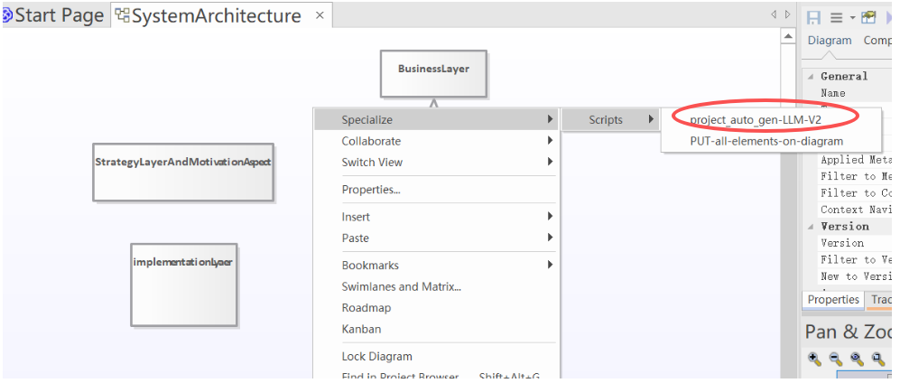
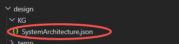

# AI4PB Orchestrator

AI4PB Orchestrator 是面向系统工程师的工作流插件，用于将 EA 架构建模结果与 VS Code 中的 AI 实现流程连接起来，帮助你更顺畅地完成“建模 → 导出 → 实现 → 对齐 → 总结”闭环。

## 插件功能

- 在侧边栏提供清晰的工作流入口，减少手动切换步骤
- 基于架构导出结果组织实现流程，避免实现偏离设计
- 提供 Prompt 集合入口，支持初始化、审计、总结等会话
- 支持对齐检查与迭代收敛，输出报告用于复盘与追踪

## 适用人群

- 使用 EA 维护架构模型的系统工程师
- 需要在 VS Code 中配合 AI 持续迭代实现的团队
- 关注“设计一致性”和“过程可追溯性”的项目成员

## 侧边栏主入口（当前界面）

在 VS Code 左侧 Activity Bar 打开 **AI4PB** 后，可看到 3 个主按钮：

1. **Initialize EA Template**
2. **Export Option**
3. **Prompt Set**

建议优先从这 3 个入口开始日常操作。

## 使用方法（推荐流程）

### 第一步：在 EA 中执行导出

1. 打开 EA 图
2. 右键打开弹出菜单
3. 选择对应导出菜单执行 (图中第一个菜单)

4. 确认架构 JSON 已更新

### 第二步：在 AI4PB 侧边栏执行 3 个主步骤

1. **Initialize EA Template**：初始化当前项目模板
2. **Export Option**：设置导出相关选项（mode / browserPath / allMaintenance）
3. **Prompt Set**：打开并使用提示词集合

## 常见使用问题

### 为什么看不到最新架构内容？

- 回到 EA 重新执行右键导出
- 确认架构 JSON 时间戳已更新

### Prompt Set 打开后缺少内容怎么办？

- 检查项目中的 Prompt 文件是否完整
- 重新通过 **Prompt Set** 入口打开
