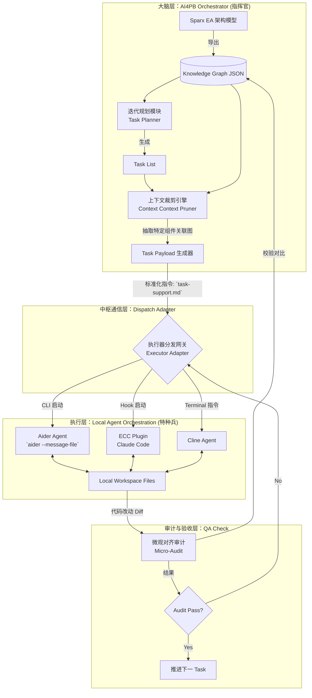

# AI4PB 智能体执行分层架构设计 (Commander-Executor Architecture)

## 📌 1. 设计理念与角色隐喻预设 (Vision & Metaphors)

在最新的应用层架构中，我们引入了 **“指挥官 - 特种兵” (Commander - Special Forces)** 的主从协作模式。解决目前单体大模型在复杂上下文中“迷失、幻觉、以及行动力不足”的痛点。

*   **👨‍✈️ 指挥官 (AI4PB Orchestrator)**：
    *   **核心职责**：战略规划、全盘上帝视角、任务下发、结果验收。
    *   **核心资产**：企业架构模型 (EA Models)、系统架构知识图谱 (`SystemArchitecture.json`)、当前迭代上下文 (Task List)。
    *   **不做什么**：不再亲自去一行行修改普通功能代码。
*   **🪖 特种兵 (Local Executors - 如 Aider / ECC / Claude Code CLI)**：
    *   **核心职责**：战术执行、局部文件多轮修改、运行测试验证 (TDD)、微观代码重构。
    *   **核心资产**：具体任务的指令 Payload、被裁切后的局部架构上下文、IDE环境上下文 (Language Server / Terminal)。
    *   **不做什么**：不负责理解产品总体战略规划，不负责跨模块的宏观架构设计。

---

## 🏗 2. 应用层架构图 (Application Layer Architecture)

下面是 AI4PB 作为高层编排器与外部自治 Agent 的集成架构图。

---

## ⚙️ 3. 核心子系统与流转设计 (Core Subsystems)

### 3.1 上下文裁剪引擎 (Context Pruner)
**特种兵不需要知道整个国家的地图，只需要他降落伞区域的地形图。**
*   **机制**：当指挥官指派 `Task_01: 实现 UserAuth 接口` 时，提取器会在 `KG JSON` 中搜索 `UserAuth` 节点，并且只保留它的 `N+1 (上游依赖)` 和 `N-1 (下游依赖)` 的 JSON 数据。
*   **输出**：将裁切后的精简架构描述生成 `.ai4pb/temp/task_context.md`。

### 3.2 任务载荷生成器 (Task Payload Generator)
为不同的底层执行器 (Aider/ECC) 动态生成它们最容易理解的“作战黑话/System Prompt”。
*   **Aider 载荷**：更偏向于直接告诉它修改哪些文件。*(例如：`aider --file src/auth.ts --message-file .ai4pb/temp/payload.md`)*
*   **ECC 载荷**：更偏向于利用它的自带 /指令。*(例如拼接命令： `/plan auth` -> `/tdd`)*

### 3.3 执行器分发网关 (Executor Adapter)
*   这是一个在 VS Code 扩展内部的 `Terminal/ChildProcess` 调度中心。
*   用户在 AI4PB 侧边栏点击 **"Execute Task 1"** 后，AI4PB 在背后生成 Payload，并隐式地在 VS Code 内置终端中敲入针对 Aider/ECC 的唤醒命令。
*   它捕获执行工具的 Exit Code 或输出，判断执行是否完成。

### 3.4 隐式微观审计机制 (Micro-Audit Loop)
*   **动作**：特种兵代码写完后（Git 变动产生）。AI4PB 自动拦截，读取变动内容。
*   **判断**：调用模型 API，带入一开始给特种兵的边界规则，判断：“这支特种兵是否越权操作？是否绕过了我们规定的 Repository 或者增加了一张不该加的表？”
*   **结果**：一旦偏移，指挥官不接受 commit，直接把 Audit 失败的结果打回去给 Aider 强制让它重改；若对齐图谱，则允许保存闭环。

---

## 🚀 4. 一步到位：全闭环接管自动化 (Full Orchestration Loop)

在此次集成的规划中，我们将跳过逐步引入的过渡阶段，采用**一步到位**的策略，直接实现全自动化工厂的闭环接管。将“文件握手、终端调度和自动化审计拦截”融合为单个全自动事务流水线：

当用户在 AI4PB 侧边栏点击特定 Task 的 **"🚀 Exec (Auto)"** 按钮时，系统将触发无缝黑盒闭环序列：

### 🔄 环节一：智能上下文封装 (Context & Payload Prep)
*   **零等待提取**：后台静默运行上下文裁剪引擎，把庞大的被关联节点（EA JSON）提取为精简局部地图 `.ai4pb/temp/pruned_architecture.md`。
*   **自动化制令**：组装特定执行者（例如 AIDER/ECC）的专属命令结构文件 `.ai4pb/temp/task_payload.md`。

### 🔄 环节二：自动化兵力下发 (Automated Agent Dispatch)
*   **终端接管**：AI4PB 调用 VS Code Terminal API，在后台创建专属的进程终端，**自动拼装并输入唤醒指令**（如通过环境变量规避交互确认界面）。
*   **静默护航**：用户不再需要手动复制任何 `aider --message-file...` 代码，真正的 "One-Click-to-Code"。

### 🔄 环节三：自动化微审计与阻断反馈 (Auto Micro-Audit & Gatekeeping)
*   **事件监听拦截**：当“特种兵”执行完成，通过监听终端子进程的 `Exit Code` 退出码，AI4PB 将接管控制流。
*   **无感微观对齐**：系统即刻在后台执行自动化的 `Micro-Audit` 对比验证：
    *   ✅ **Audit Pass (对齐)**: 自动化 Git 提交确认流程（或闭环通知 UI 面板任务完成）。 
    *   ❌ **Audit Reject (越权)**: 审计不通过说明特种兵写脱了，AI4PB 会提取失败的分析报告作为新的 Payload，重新挂载到该终端**打回去强制重改 (Auto-Retry)**，直至架构对齐。

---

## ⚡️ 5. Zero-Code 无缝协作策略 (No-Modification Integration)

为了**不改动 ECC 或 AIDER 的任何一行源代码**，指挥官 (AI4PB) 将完全通过**环境变量、标准输入输出流 (STDIN/STDOUT)、配置文件挂载和文件系统事件**来进行控制和接管。
 
### 5.1 对 Aider 的无侵入控制
Aider 原生支持极强的 CLI 参数，AI4PB 作为指挥官只需作为一个外层 Shell 包装器：
*   **任务下发**：AI4PB 自动拼装执行命令，绝不侵入 Aider 内部。
    `aider --message-file .ai4pb/temp/task_payload.md --yes --auto-commits`
*   **上下文注入**：Aider 支持 `--read` 读取只读参考文件，AI4PB将架构约束作为制度文件输入：
    `aider --read .ai4pb/temp/pruned_architecture.md`
*   **监控与强制**：通过向 `task_payload.md` 注入明确的系统约定，并在其运行完毕检查其提交的 Git diff 或退出码。

### 5.2 对 ECC (Claude Code) 的无侵入控制
ECC 的核心是由 `.claude` 文件夹驱动。这就是我们最大的施力杠杆，我们可以动态操控它的地盘：
*   **沙盒配置劫持**：在执行前，AI4PB 动态生成项目运行目录的 `.claude/rules/` （临时注入来自 Sparx EA 的强制架构规则）和 `.claude/hooks.json` （劫持执行后回调以实现微审计）。
*   **自动输入指令**：通过 Terminal 的 `sendText` API，当打开 Claude Code 时，AI4PB 自动喂入指令 `/tdd "根据 .ai4pb/temp/task_payload.md 的要求实现功能"`，将繁杂的任务描述封存在文件中让其去读。
*   **Instincts / Skills 提取**：在 ECC 操作完毕后，AI4PB 只需要简单读取 ECC 的本地文件就可以将其“学习”到的经验提取为我们架构的反馈（Feedback Loop）。

---