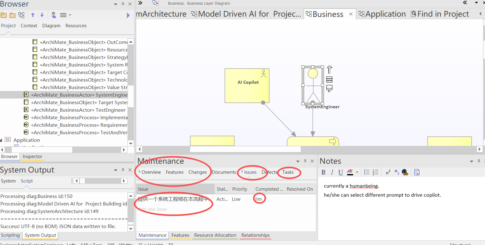
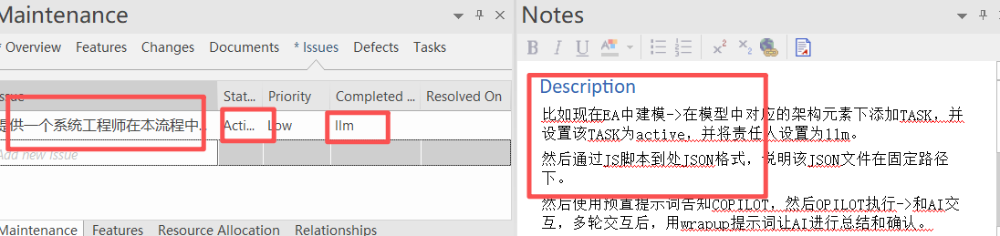
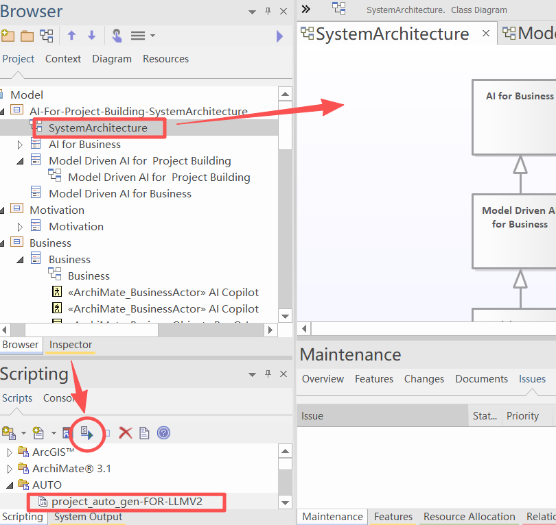

// @ArchitectureID: 1184
# 系统工程师辅助编码标准流程（EA + VS Code + Copilot）

本指南按照系统工程师在日常工作中的典型过程组织，说明如何利用 Enterprise Architect (EA)、Visual Studio Code 和 GitHub Copilot 实现模型驱动开发（MDD）闭环。

> 当前约定：EA 导出采用 **bootstrap + 本地共享脚本** 模式，配置统一放在项目根目录 `.aicodingconfig`。

## 1. 启动阶段：建模与任务创建

系统工程师的工作从架构建模起步：

1. 打开或创建 EA 工程模型。确定当前迭代/版本的目标范围。
2. 在相关架构元素上添加或更新 `project_info` 属性。

3. 在 `tasks` 数组中新增或调整任务，填写：
   - 状态（如 **Active**, **To Do** 等）
   - 负责人 `assigned_to`（对 AI 任务设为 `llm`）
   - 起止日期、优先级等元数据
   
4. 保存模型并导出 JSON，确保架构源文件最新（见第 2 节）。

## 2. 一次性环境准备（每个 EA 模型）

为避免在多个 EA 模型间反复复制完整导出脚本，采用以下一次性设置：

1. 在 EA 模型中只保留并运行 bootstrap：
   - `script/EA-jsscript/project_auto_gen_suitable_for_LLM-V2-bootstrap.js`
2. 在 bootstrap 中确认本地共享脚本路径：
   - `SHARED_SCRIPT_PATH`（主路径）
   - `SHARED_SCRIPT_LOCAL_FALLBACK_PATH`（兜底路径）
3. 在项目根目录维护 `.aicodingconfig`（供 bootstrap 自动读取），至少包含：
   - `EA_AUTOGEN_CONFIG.sharedScriptPath`
   - 导出行为开关（如 `needContent`、`maintenacetype`）
4. `projectPath` 不需要手填，由脚本根据当前 EA 模型文件位置自动推断。

## 3. 导出架构数据（每次模型更新后）

每次修改模型后，立即执行：

1. 在 EA 中运行 bootstrap 脚本，由其加载本地共享脚本并执行导出。

2. 导出 JSON 默认写入：`design/KG/SystemArchitecture.json`（或脚本配置指定路径）。
3. 导出完成后，确认无报错并检查文件时间戳已更新。
4. 该 JSON 将成为 Copilot 会话及其他自动化流程的输入。

## 4. 利用 Copilot 进行实现与文档生成

在完成建模并导出 JSON 后，进入 VS Code：

1. 打开工作区并确认 `design/KG/SystemArchitecture.json` 已更新。
2. 依照当前工作阶段选择适当的 Prompt（有关详细说明请参考 [workprompt/README.md](../../workprompt/README.md)）：
   - **迭代启动**：运行 `initial-prompt.md`，生成目标与初步任务。
   - **系统逆向或审计**：必要时运行 `reverse-engineer-WHOLE.md`。
   - **阶段总结**：结束会话时发起 `Wrap-up Prompt.md`。
3. 在 Copilot 生成的输出中迭代修改、补充并保存到相关源位置或指定的项目交付目录。
4. 每轮交互结束后，可将输出结果记录在文档区以备审查。

## 5. 日常同步与回顾

系统工程师应按照节奏周期性执行：

1. 每次实现或文档变更后，重新导出模型并检查任务状态。
2. 如发现实现偏离或架构调整，借助 `reverse-engineer-WHOLE.md` 或“设计与实现同步”提示让 AI给出审计建议。
3. 根据 AI 输出在 EA 中更新元素/任务，让模型与实现保持一致。

## 6. 文档存档与追溯

- 定期备份 `design/KG/SystemArchitecture.json` 和相关工作目录，便于审计与回溯。
- 建议同时备份：
   - `.aicodingconfig`
   - `script/EA-jsscript/project_auto_gen_suitable_for_LLM-V2-bootstrap.js`
   - `script/EA-jsscript/project_auto_gen_suitable_for_LLM-V2.js`

---

本流程涵盖从建模、导出、实现、报告到审计的完整闭环，适用于系统工程师的常规工作周期。